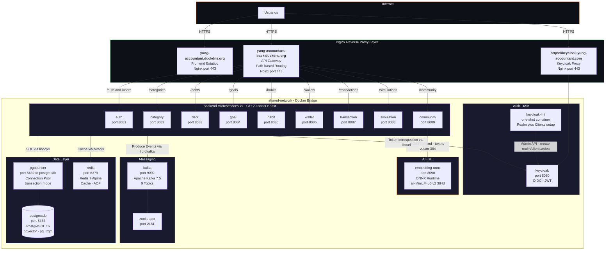
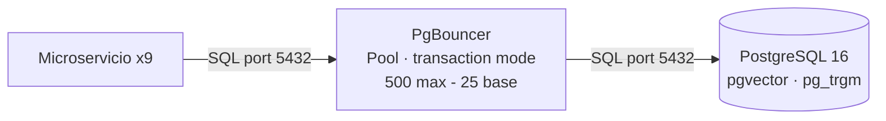
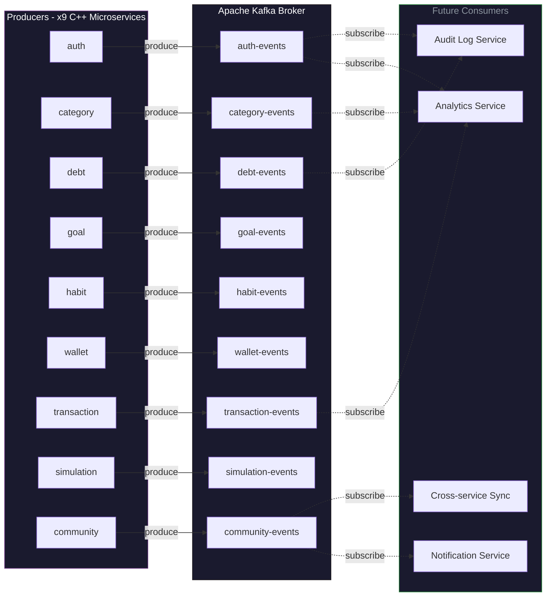

# Yung Accountant — Documentación de Arquitectura

Arquitectura de Software (Electiva II). Plataforma de gestión financiera personal con componentes sociales, orientada a municipalidades colombianas (Duitama, Sogamoso, Tunja).

---

## Stack Tecnológico — Badges

### Lenguajes


### Backend — C++ Frameworks & Librerías


### Frontend


### Base de Datos & Caché


### Mensajería & Eventos


### Autenticación & Autorización


### AI / Machine Learning


### Contenedores & Orquestación


### Infraestructura & Red


### Cloud & Almacenamiento


### Build & Toolchain


### Arquitectura & Patrones
-6C3483?style=for-the-badge&logo=databricks&logoColor=white)


---

## Tabla de Contenido

1. [Visión General](#1-visión-general)
2. [Stack Tecnológico](#2-stack-tecnológico)
3. [Topología de Red y Puertos](#3-topología-de-red-y-puertos)
4. [Infraestructura: Docker y Docker Compose](#4-infraestructura-docker-y-docker-compose)
5. [Capa de Datos: PostgreSQL + pgvector + Redis](#5-capa-de-datos-postgresql--pgvector--redis)
6. [Autenticación y Autorización: Keycloak](#6-autenticación-y-autorización-keycloak)
7. [Microservicios Backend (C++)](#7-microservicios-backend-c)
   - [7.1 Patrón Arquitectónico Común](#71-patrón-arquitectónico-común)
   - [7.2 Auth (Puerto 8081)](#72-auth-puerto-8081)
   - [7.3 Category (Puerto 8082)](#73-category-puerto-8082)
   - [7.4 Debt (Puerto 8083)](#74-debt-puerto-8083)
   - [7.5 Goal (Puerto 8084)](#75-goal-puerto-8084)
   - [7.6 Habit (Puerto 8085)](#76-habit-puerto-8085)
   - [7.7 Wallet (Puerto 8086)](#77-wallet-puerto-8086)
   - [7.8 Transaction (Puerto 8087)](#78-transaction-puerto-8087)
   - [7.9 Simulation (Puerto 8088)](#79-simulation-puerto-8088)
   - [7.10 Community (Puerto 8089)](#710-community-puerto-8089)
8. [Frontend SPA (React + TypeScript)](#8-frontend-spa-react--typescript)
9. [Servicio de Embeddings (ONNX)](#9-servicio-de-embeddings-onnx)
10. [Streaming de Eventos: Apache Kafka](#10-streaming-de-eventos-apache-kafka)
11. [API Gateway y Reverse Proxy: Nginx](#11-api-gateway-y-reverse-proxy-nginx)
12. [Despliegue en Producción](#12-despliegue-en-producción)
13. [Flujo de Startup](#13-flujo-de-startup)
14. [Consideraciones de Seguridad](#14-consideraciones-de-seguridad)
15. [Desarrollo Local](#15-desarrollo-local)

---

## 1. Visión General

Yung Accountant es una aplicación de finanzas personales desplegada sobre una arquitectura de **microservicios en contenedores Docker**. El sistema se compone de **18 contenedores** organizados en **5 stacks de Docker Compose** independientes que se comunican a través de una red bridge compartida.

### Diagrama de Arquitectura



### Principios Arquitectónicos

| Principio | Implementación |
|-----------|---------------|
| **Base de datos por servicio** | No — todos los servicios comparten una base PostgreSQL. Las tablas están acopladas (ej. debt escribe en `transactions` y `wallets`) |
| **Comunicación asíncrona** | Kafka para eventos de auditoría (solo productores, sin consumidores actualmente) |
| **Autenticación centralizada** | Keycloak como Identity Provider OIDC. Cada microservicio valida tokens independientemente |
| **Cache distribuido** | Redis con TTL de 300s. Cada servicio mantiene sus propias claves con invalidación por conjuntos (SETS) |
| **API Gateway** | Nginx con enrutamiento basado en path (`/auth/*` → `:8081`, `/community/*` → `:8089`, etc.) |
| **Contenedores efímeros** | Todos los servicios son stateless. El estado reside en PostgreSQL, Redis y los volúmenes Docker |

---

## 2. Stack Tecnológico

### Backend — C++20

| Componente | Tecnología | Versión | Propósito |
|------------|-----------|---------|-----------|
| Lenguaje | C++ | 20 (g++ 13.2) | Rendimiento, control de memoria, compilación nativa |
| Servidor HTTP | Boost.Beast | 1.84 | HTTP/1.1 server sobre Boost.Asio sin framework externo |
| JSON | Boost.JSON | 1.84 | Serialización/deserialización nativa |
| Base de datos | libpqxx | 7.8.1 | Cliente PostgreSQL C++ (compilado desde fuente) |
| Cache | hiredis | 1.2 | Cliente Redis C (síncrono, mutex-protected) |
| Mensajería | librdkafka | 2.3 | Producer Kafka C++ (compresión Snappy) |
| HTTP Client | libcurl | 8.5 | Llamadas a Keycloak, Cloudinary, Embedding Service |
| SSL/TLS | OpenSSL | 3.1 | Soporte HTTPS para llamadas externas |
| Contenedor base | Alpine Linux | 3.19 | Imagen ~6 MB, multi-stage build |

### Frontend — Node.js / Browser

| Componente | Tecnología | Versión | Propósito |
|------------|-----------|---------|-----------|
| Runtime | Node.js | — | Build toolchain |
| Bundler | Vite | 8.0 | Dev server + build optimizado (Rolldown) |
| UI Framework | React | 19.2 | Componentes funcionales + hooks |
| Lenguaje | TypeScript | 6.0 | Tipado estático estricto |
| CSS | Tailwind CSS | 4.2 | Utility-first CSS |
| Estado global | Zustand | 5.0 | Stores persistentes con middleware `persist` |
| Ruteo | react-router-dom | 7.1 | Lazy loading por página |
| HTTP Client | Axios | 1.16 | Interceptores para token JWT y refresh automático |
| Gráficos | Chart.js + react-chartjs-2 | 4.4 + 5.2 | Visualización de datos financieros |
| Animaciones | canvas-confetti | 1.9 | Efectos visuales (metas cumplidas) |
| Íconos | lucide-react | 0.468 | Iconografía consistente |
| Fechas | date-fns | 4.1 | Formateo y manipulación de fechas |

### Infraestructura de Datos

| Componente | Tecnología | Versión | Propósito |
|------------|-----------|---------|-----------|
| Base de datos | PostgreSQL + pgvector | 16 | Datos relacionales + búsqueda vectorial |
| Búsqueda texto | pg_trgm | — (built-in) | Búsqueda trigram con puntuación de similitud |
| Pool de conexiones | PgBouncer | latest | Connection pooling modo transacción (500 max) |
| Cache | Redis | 7 (Alpine) | Caché en memoria con persistencia AOF |
| Admin DB | pgAdmin | 4 (latest) | UI web para gestión PostgreSQL |
| Admin Redis | Redis Insight | latest | UI web para monitoreo Redis |

### Mensajería y Eventos

| Componente | Tecnología | Versión | Propósito |
|------------|-----------|---------|-----------|
| Broker | Apache Kafka | 7.5 (Confluent) | Streaming de eventos |
| Coordinación | ZooKeeper | 7.5 (Confluent) | Gestión de clúster Kafka |
| Admin UI | Kafka UI | latest | Monitoreo de tópicos y mensajes |

### Identidad y Autenticación

| Componente | Tecnología | Versión | Propósito |
|------------|-----------|---------|-----------|
| IAM | Keycloak | 22.0.5 | OpenID Connect Provider |
| Init | Alpine + bash | 3.19 | Script de inicialización de realm/clientes |

### AI / Embeddings

| Componente | Tecnología | Versión | Propósito |
|------------|-----------|---------|-----------|
| Runtime | ONNX Runtime | 1.19.2 | Inferencia de embeddings |
| Modelo | all-MiniLM-L6-v2 | — (HuggingFace) | Sentence transformer, 384 dimensiones |
| Tokenizer | WordPiece (BERT) | — | 230 tokens de vocabulario |
| Servidor | Boost.Beast (C++) | 1.84 | Endpoint REST `/embed` |

### Infraestructura de Red y Producción

| Componente | Tecnología | Propósito |
|------------|-----------|-----------|
| Contenedores | Docker + Docker Compose | 5 stacks independientes |
| Reverse Proxy | Nginx | Terminación SSL + API Gateway + hosting estático |
| SSL/TLS | Let's Encrypt (certbot) | Certificados gratuitos renovables |
| DNS Dinámico | DuckDNS | 3 dominios públicos gratuitos |
| Cloud | Oracle Cloud VM | Máquina virtual Ubuntu |
| Imágenes | Cloudinary | Almacenamiento de imágenes de perfil y posts |

---

## 3. Topología de Red y Puertos

### Red Docker

Todos los contenedores se conectan a una única **red bridge externa** llamada `shared-network`. Esto permite que los contenedores de diferentes stacks se descubran por nombre de contenedor (DNS interno de Docker).

```bash
docker network create shared-network
```

### Mapa Completo de Puertos

| Contenedor | Puerto Host | Puerto Contenedor | Protocolo | Exposición |
|------------|-------------|-------------------|-----------|------------|
| **Infraestructura de Datos** |
| postgresdb | 5432 | 5432 | PostgreSQL | Externa |
| pgbouncer | 6432 | 5432 | PostgreSQL (pooled) | Externa |
| pgadmin | 5050 | 80 | HTTP | Externa |
| redis | 6379 | 6379 | Redis | Externa |
| redis-insight | 5540 | 5540 | HTTP | Externa |
| **Mensajería** |
| zookeeper | 2181 | 2181 | ZooKeeper | Interna |
| kafka | 9092 | 9092 | PLAINTEXT | Externa |
| kafka-ui | 8079 | 8080 | HTTP | Externa |
| **Identidad** |
| keycloak | 8080 | 8080 | HTTP | Externa |
| **Backend (×9 microservicios)** |
| auth | 8081 | 8081 | HTTP | Externa |
| category | 8082 | 8082 | HTTP | Externa |
| debt | 8083 | 8083 | HTTP | Externa |
| goal | 8084 | 8084 | HTTP | Externa |
| habit | 8085 | 8085 | HTTP | Externa |
| wallet | 8086 | 8086 | HTTP | Externa |
| transaction | 8087 | 8087 | HTTP | Externa |
| simulation | 8088 | 8088 | HTTP | Externa |
| community | 8089 | 8089 | HTTP | Externa |
| **AI** |
| embedding-onnx | 8090 | 8090 | HTTP | Externa |

### Nombres DNS Internos (Docker)

Dentro de `shared-network`, cada contenedor es accesible por su **nombre de servicio**:

| Nombre DNS | Resuelve a | Usado por |
|------------|-----------|-----------|
| `pgbouncer` | Pool de conexiones PostgreSQL | Los 9 microservicios |
| `postgresdb` | PostgreSQL directo | pgbouncer |
| `redis` | Redis cache | Los 9 microservicios |
| `kafka` | Kafka broker | Los 9 microservicios |
| `zookeeper` | ZooKeeper | kafka |
| `keycloak` | Keycloak IAM | Los 9 microservicios + keycloak-init |
| `embedding-onnx` | Servicio de embeddings | community (puerto 8089) |

---

## 4. Infraestructura: Docker y Docker Compose

> **Nota para ingenieros nuevos en Docker:** Docker empaqueta aplicaciones en *contenedores* — unidades ligeras y aisladas que incluyen código, dependencias y sistema operativo mínimo. Una *imagen* es la plantilla inmutable (como un `.iso`); un *contenedor* es la instancia en ejecución. *Docker Compose* permite definir y ejecutar múltiples contenedores como una unidad. Cada `docker-compose.yml` describe servicios, redes, volúmenes y variables de entorno.

### 4.1 Los 5 Stacks

El proyecto se divide en **5 stacks independientes**, cada uno en su propio directorio con su `docker-compose.yml` y `.env`:

#### Stack 1: `database/` — Capa de persistencia

```yaml
# Servicios: postgresdb, pgbouncer, pgadmin, redis, redis-insight
```

- **postgresdb**: PostgreSQL 16 con extensiones `pgvector`, `pg_trgm`, `uuid-ossp`. Los scripts en `init-scripts/` se ejecutan automáticamente al iniciar por primera vez. Volumen persistente: `postgres_data`.
- **pgbouncer**: Proxy de conexiones que actúa como intermediario entre los microservicios y PostgreSQL. Modo `transaction` (la conexión se libera al terminar cada transacción). Límite: 500 clientes máximo, 25 conexiones por pool, 5 de reserva. Esto evita que 9 servicios × 20 conexiones cada uno (180 conexiones directas) saturen PostgreSQL.
- **pgadmin**: Interfaz web administrativa para PostgreSQL en `http://localhost:5050`.
- **redis**: Redis 7 con persistencia AOF (Append-Only File). Protegido por contraseña. Healthcheck vía `redis-cli ping`.
- **redis-insight**: GUI para Redis en `http://localhost:5540`.

#### Stack 2: `kafka/` — Mensajería

```yaml
# Servicios: zookeeper, kafka, kafka-ui
```

- **zookeeper**: Coordinador de clúster (requerido por Kafka). Un solo nodo. Volumen: `zookeeper_data`.
- **kafka**: Broker único. Listener PLAINTEXT en `kafka:9092` (solo accesible dentro de la red Docker). Factor de replicación 1 (sin redundancia — adecuado para desarrollo, no para producción). Volumen: `kafka_data`.
- **kafka-ui**: Dashboard web en `http://localhost:8079` para inspeccionar tópicos, mensajes y estado del broker.

#### Stack 3: `keycloak/` — Identidad

```yaml
# Servicios: keycloak, keycloak-init
```

- **keycloak**: Keycloak 22.0.5 en modo desarrollo (`start-dev`) con base de datos H2 embebida. Proxy mode `edge` para operar detrás de Nginx con terminación SSL. Healthcheck vía endpoint `/realms/master`.
- **keycloak-init**: Contenedor **efímero** (`restart: "no"`) basado en Alpine que ejecuta `initialize.sh`. Este script:
  1. Obtiene un token de administrador del master realm
  2. Crea el realm `yung-accountant`
  3. Configura tiempos de vida de tokens (access: 30 min, SSO: 24h idle / 7 días max, offline: 30 días / 60 días)
  4. Crea 3 clientes OIDC confidenciales (alcaldia-duitama, alcaldia-sogamoso, alcaldia-tunja)
  5. Crea roles (`ama-de-casa`, `estudiante`, `trabajador`) y protocol mappers (`postgresId`, `age`, `clientId`, `role`) para cada cliente

#### Stack 4: `backendcpp/` — Lógica de negocio

```yaml
# Servicios: auth, category, debt, goal, habit, wallet, transaction, simulation, community
```

Los 9 microservicios comparten el mismo patrón de construcción (ver [Sección 7](#7-microservicios-backend-c)). Cada uno tiene su propio `Dockerfile.alpine` con compilación multi-stage. Las variables de entorno se cargan desde `backendcpp/.env`.

#### Stack 5: `embedding-onnx/` — IA / NLP

```yaml
# Servicios: embedding-onnx
```

Construcción en 3 etapas (ver [Sección 9](#9-servicio-de-embeddings-onnx)). El modelo se descarga y exporta a ONNX durante el build. El contenedor expone un endpoint REST en puerto 8090.

### 4.2 Conceptos Clave de Docker Compose

**`env_file` vs `environment`:**
- `env_file: .env` carga TODAS las variables del archivo `.env` dentro del contenedor en tiempo de ejecución
- `environment:` con `${VAR}` usa sustitución de variables de Docker Compose (se resuelven al momento de hacer `docker compose up`, desde el shell del host o desde un archivo `.env` en el directorio del compose)

**Volúmenes vs Bind Mounts:**
- `postgres_data`, `kafka_data`, `redis_data` — **volúmenes nombrados** gestionados por Docker. Persistentes aunque se elimine el contenedor
- `./init-scripts:/docker-entrypoint-initdb.d` — **bind mount**. Monta un directorio del host dentro del contenedor. Útil para desarrollo pero dependiente del filesystem del host

**Healthchecks:**
- `postgresdb`: `pg_isready` — verifica que PostgreSQL acepte conexiones
- `redis`: `redis-cli ping` — verifica que Redis responda
- `keycloak`: `curl localhost:8080/realms/master` — verifica que Keycloak esté sirviendo requests
- `embedding-onnx`: `curl localhost:8090/health` — verifica que el modelo esté cargado
- Los microservicios backend **no tienen healthcheck definido**

**Política de reinicio:**
- `restart: always` — Servicios de larga duración (bases de datos, backend, keycloak)
- `restart: "no"` — Tareas de inicialización únicas (keycloak-init)
- `restart: unless-stopped` — embedding-onnx

---

## 5. Capa de Datos: PostgreSQL + pgvector + Redis

### 5.1 PostgreSQL 16 — Esquema

El esquema se define en `database/init-scripts/01-init.sql` (650 líneas). Se ejecuta automáticamente la primera vez que el contenedor `postgresdb` arranca.

#### Extensiones

| Extensión | Propósito |
|-----------|-----------|
| `uuid-ossp` | Generación de UUIDs v4 como claves primarias |
| `pg_trgm` | Índices GIN trigram para búsqueda de texto con similitud |
| `vector` | Tipo de dato `vector(384)` y operadores de distancia coseno (pgvector) |

#### Tablas (13 total)

| # | Tabla | Columnas Clave | Descripción |
|---|-------|---------------|-------------|
| 1 | `users` | id (UUID PK), email (UNIQUE), username (UNIQUE), keycloak_id (UNIQUE), client_id, role, age (0-150), profile_pic, plan ('free'), followers (UUID[]), following (UUID[]) | Usuarios del sistema |
| 2 | `categories` | id (UUID PK), user_id (FK nullable), name, type (income/expense), icon, color, is_system | Categorías de ingresos/gastos (18 de sistema + personalizadas) |
| 3 | `wallets` | id, user_id (FK), name, type (cash/bank_account/credit_card/debit_card/other), current_balance | Carteras/billeteras |
| 4 | `transactions` | id, user_id (FK), wallet_id (FK), category_id (FK), amount, description, date, tags (TEXT[]) | Transacciones financieras |
| 5 | `goals` | id, user_id (FK), name, target_amount, current_amount, priority (high/medium/low), status (active/completed/failed) | Metas de ahorro |
| 6 | `debts` | id, user_id (FK), type (borrowed/lent), original_amount, remaining_balance, interest_rate, interest_type (fixed/variable), status (active/paid/defaulted) | Deudas y préstamos |
| 7 | `debt_payments` | id, debt_id (FK), amount, interest_amount, principal_amount, remaining_balance | Historial de pagos de deudas |
| 8 | `variable_interests` | id, debt_id (FK), month, rate. UNIQUE (debt_id, month) | Tasas de interés variables por mes |
| 9 | `goal_transactions` | id, goal_id (FK), amount, type (add/remove), wallet_id (FK) | Aportes y retiros de metas |
| 10 | `habits` | id, user_id (FK), name, is_active, current_streak, best_streak, checks (JSONB) | Hábitos con historial de cumplimiento |
| 11 | `posts` | id, user_id (FK), title, content, image_url, tags (TEXT[]), embedding (vector(384)), search_vector (tsvector), likes_count, liked_by (UUID[]) | Posts de la comunidad |
| 12 | `comments` | id, post_id (FK), user_id (FK), parent_id (FK auto-referencia), content, likes_count, liked_by (UUID[]) | Comentarios anidados (soporta replies) |
| 13 | `user_post_interactions` | user_id + post_id (PK compuesta), liked, commented, viewed_at, interaction_score | Tracking de interacciones para recomendaciones |

#### Categorías del Sistema (18 inserts iniciales)

| Tipo | Categorías |
|------|-----------|
| Income | Salary, Freelance, Gift, Investment |
| Ambos | Wallet Transfer |
| Expense | Food, Transport, Entertainment, Savings, Health, Education, Rent, Utilities, Shopping, Travel |
| Deuda/Meta | Borrow, Lent, Debt Payment, Debt Collection, Goal Transaction |

#### Índices

| Tabla | Tipo | Columnas | Propósito |
|-------|------|----------|-----------|
| users | GIN trigram | username, display_name, first_name, last_name, bio | Búsqueda de usuarios con puntuación de similitud |
| posts | GIN trigram | title, content, tags | Búsqueda full-text + similitud |
| posts | GIN | search_vector | Búsqueda tsvector (inglés) |
| posts | IVFFLAT | embedding vector_cosine_ops (lists=100) | Búsqueda semántica por similitud coseno |
| comments | GIN trigram | content | Búsqueda en comentarios |
| Todas las FK | B-tree | Cada foreign key | Performance de JOINs |

#### Funciones Almacenadas (Stored Procedures)

| Función | Parámetros | Retorna | Usada por |
|---------|-----------|--------|-----------|
| `search_users_trgm(search_query, page, page_size)` | query TEXT, page INT, size INT | TABLE con similarity score | Búsqueda de usuarios en comunidad |
| `search_posts_optimized(search_query, limit_count, user_id, client_id_param, user_role)` | query, limit, user_id, client, role | Posts con ranking | Búsqueda textual de posts |
| `get_recommended_posts_optimized(limit_count, user_id)` | limit, user_id | Posts recomendados | Feed de recomendaciones |
| `get_personalized_feed(limit_count, user_id, user_tags)` | limit, user_id, tags | Posts personalizados | Feed personalizado |
| `get_trending_posts(limit_count, user_id, time_window_hours)` | limit, user_id, hours | Posts trending | Sidebar de tendencias |
| `search_posts_semantic(query_embedding, limit_count, user_id)` | embedding, limit, user_id | Posts por similitud coseno | Búsqueda semántica |

### 5.2 PgBouncer — Connection Pooling

PgBouncer se sitúa entre los microservicios y PostgreSQL:



- **Modo:** `transaction` — la conexión se devuelve al pool después de cada transacción SQL (ideal para cargas HTTP request/response)
- **Capacidad:** 500 clientes máx, 25 conexiones base, 5 de reserva
- **Timeout de reserva:** 3 segundos
- **Conexiones máximas a PostgreSQL:** 50

Sin PgBouncer, 9 servicios con pools de 20 conexiones cada uno = 180 conexiones directas. PgBouncer multiplexa esto sobre ~25-50 conexiones reales a PostgreSQL.

### 5.3 Redis — Estrategia de Caché

Cada microservicio implementa su propia lógica de caché en Redis usando el patrón **cache-aside**:

```
1. GET clave
2. Si existe → retornar (cache hit)
3. Si no existe → consultar PostgreSQL → guardar en Redis con SETEX (TTL 300s) → retornar
```

**Invalidación por conjuntos (Redis SETS):**
- Al crear/leer un recurso: `SADD user:{userId}:{resource}:keys {cacheKey}`
- Al invalidar: `SMEMBERS` obtiene todas las claves → `DEL` para cada una
- Fallback: `SCAN` con patrón para limpieza bulk

**TTL estándar:** 300 segundos (5 minutos) para datos de usuario, categorías, deudas, metas, hábitos, wallets, transacciones, simulaciones.

**Claves comunes:**
- `user:{userId}:*` — Datos de usuario y perfil
- `cache:debts:user:{userId}` — Lista de deudas
- `cache:goals:user:{userId}:*` — Metas y transacciones
- `posts:page:{N}:limit:{M}` — Páginas de posts cacheadas
- `recommended:user:{userId}` — Posts recomendados
- `trending:posts` — Posts trending (global)

---

## 6. Autenticación y Autorización: Keycloak

### 6.1 Arquitectura OIDC

Keycloak actúa como **OpenID Connect Provider**. El flujo de autenticación es:

```
1. Frontend → POST /auth/login (email + password + clientId)
2. Backend (auth:8081) → verifica credenciales en PostgreSQL → obtiene token de Keycloak
3. Keycloak → retorna access_token (JWT, 30 min) + refresh_token (offline, 60 días)
4. Frontend almacena tokens en localStorage
5. Cada request subsiguiente → Authorization: Bearer <access_token>
6. Cada microservicio → valida token contra Keycloak (local JWT exp check + remote introspection)
```

### 6.2 Configuración del Realm

| Parámetro | Valor |
|-----------|-------|
| Realm | `yung-accountant` |
| Display Name | Yung Accountant |
| Login with email | Habilitado |
| Self-registration | Deshabilitado |
| Password reset | Habilitado |
| Remember me | Habilitado |
| Access Token Lifespan | 1800s (30 min) |
| SSO Session Idle | 86400s (24 horas) |
| SSO Session Max | 604800s (7 días) |
| Offline Session Idle | 2592000s (30 días) |
| Offline Session Max | 5184000s (60 días) |

### 6.3 Clientes OIDC (3)

Cada municipio tiene su propio cliente confidencial en Keycloak:

| Client ID | Nombre | Service Accounts | Standard Flow | Direct Access |
|-----------|--------|-----------------|---------------|---------------|
| `alcaldia-duitama` | Alcaldía de Duitama | ✅ | ✅ | ✅ |
| `alcaldia-sogamoso` | Alcaldía de Sogamoso | ✅ | ✅ | ✅ |
| `alcaldia-tunja` | Alcaldía de Tunja | ✅ | ✅ | ✅ |

### 6.4 Roles por Cliente

Cada cliente tiene 3 roles que determinan el perfil financiero del usuario:

| Rol | Descripción |
|-----|-------------|
| `ama-de-casa` | Gestión de hogar — perfil de gastos domésticos |
| `estudiante` | Estudiante — perfil de ingresos limitados, gastos educativos |
| `trabajador` | Trabajador — perfil de ingresos regulares, capacidad de ahorro |

### 6.5 Protocol Mappers — Claims en el JWT

Los mappers insertan atributos de usuario de Keycloak como claims en el token JWT:

| Mapper | Atributo de Usuario | Claim en JWT | Disponible en |
|--------|--------------------|--------------|---------------|
| `postgresId` | `postgresId` | `postgresId` | access, id, userinfo |
| `age` | `age` | `age` | access, id, userinfo |
| `clientId` | `clientId` | `clientId` | access, id, userinfo |
| `role` | `role` | `role` | access, id, userinfo |

### 6.6 Validación de Token en C++

Cada microservicio backend implementa `KeycloakClient::verifyAndGetUser()`:

1. Extrae el header `Authorization: Bearer <token>`
2. Decodifica el payload JWT (base64) y verifica `exp` (expiry) localmente
3. Si el token no ha expirado → cache en memoria (60s TTL por instancia de servicio)
4. Si expiró o no está en cache → `POST /protocol/openid-connect/token/introspect` contra Keycloak
5. Itera sobre los 3 clientes (duitama, sogamoso, tunja) con sus respectivos secrets
6. Retorna struct `UserInfo` con: `postgresId`, `email`, `username`, `clientId`, `role`, `age`, `roles[]`
7. Si `postgresId` está vacío → 401 Unauthorized

### 6.7 Flujo de Refresh Token (Frontend)

El frontend implementa un **sistema de cola de refresh** en `axios.config.ts`:

```
Request → 401 → ¿Es /auth/refresh? → Sí → dispatch 'auth:unauthorized' (logout)
                      ↓ No
               ¿Es /auth/login o /users/register? → Sí → rechazar (no reintentar)
                      ↓ No
               ¿Ya está refrescando? → Sí → encolar request
                      ↓ No
               POST /auth/refresh (con refresh_token + client_id)
                      ↓
               ¿Éxito? → Sí → guardar nuevo token → procesar cola → reintentar request original
                      ↓ No
               Dispatch 'auth:unauthorized' → limpiar localStorage → redirigir a Home
```

Esto evita múltiples requests simultáneos de refresh cuando varias peticiones fallan a la vez.

---

## 7. Microservicios Backend (C++)

### 7.1 Patrón Arquitectónico Común

Los **9 microservicios** comparten una arquitectura interna idéntica. Solo difieren en la lógica de dominio, endpoints REST y tópico Kafka.

#### Estructura de Archivos (cada servicio)

```
backendcpp/{service}/
├── CMakeLists.txt
├── Dockerfile.alpine
├── include/
│   ├── database.hpp          # Pool de conexiones PostgreSQL (singleton)
│   ├── redis_client.hpp      # Cliente Redis con serialización JSON (singleton)
│   ├── kafka_producer.hpp    # Producer Kafka con compresión Snappy (singleton)
│   └── keycloak_auth.hpp     # Cliente Keycloak + verificación JWT
└── src/
    ├── main.cpp              # Entrada: HTTP server + rutas + signal handlers
    └── {service}_service.cpp # Lógica de dominio específica
```

#### Componentes Compartidos

**1. Servidor HTTP (Boost.Beast)**

Cada servicio inicia un `HttpServer` que:
- Usa `net::io_context` con un thread pool de `std::thread::hardware_concurrency()` hilos
- Acepta conexiones TCP en un `tcp::acceptor`
- Cada conexión es manejada por una `HttpSession` con timeout de 30 segundos
- El ruteo se hace manualmente con `if/else if` sobre `req.method()` y `req.target()` (sin framework de ruteo)
- CORS configurado para orígenes: `http://localhost:5173`, `http://localhost:3000`, `https://yung-accountant.duckdns.org`

**2. Middleware de Autenticación**

Cada endpoint (excepto health, register, login, clients, roles) ejecuta:
```cpp
UserInfo user = keycloakClient.verifyAndGetUser(req);
if (!user.isValid) {
    sendResponse(res, 401, "Unauthorized");
    return;
}
```

**3. Pool de Conexiones PostgreSQL**

- Singleton `Database::getInstance()` con un pool de 20 conexiones `pqxx::connection*`
- RAII: `PoolConnection` adquiere del pool al construirse, libera al destruirse
- Conexiones muertas se reemplazan automáticamente
- Cada servicio se conecta a `pgbouncer:5432` (variable `POSTGRES_HOST`)

**4. Cliente Redis**

- Singleton `RedisClient` protegido por `std::mutex`
- Operaciones: `SETEX` (con TTL), `GET`, `DEL`, `SADD`, `SREM`, `SMEMBERS`, `SCAN`, `INCRBY`, `EXPIRE`
- Templates `setJson<T>()` / `getJson<T>()` para serialización JSON automática
- `delByPattern()` usa `SCAN` + pipeline `DEL` para invalidación masiva

**5. Producer Kafka**

- Singleton `kafka::Producer` por servicio usando `librdkafka++`
- Conexión a `KAFKA_BROKER` (default: `kafka:9092`)
- Compresión Snappy, callbacks de delivery report y eventos
- Método `produce(topic, event)` serializa `boost::json::value`

**6. Signal Handlers**

Todos los servicios capturan señales de crash:
```cpp
signal(SIGSEGV, [](int) { _exit(1); });
signal(SIGABRT, [](int) { _exit(1); });
signal(SIGFPE,  [](int) { _exit(1); });
signal(SIGILL,  [](int) { _exit(1); });
```

#### Proceso de Build

Cada `Dockerfile.alpine` usa multi-stage build:

**Stage 1 (builder) — Alpine 3.19:**
```dockerfile
RUN apk add build-base cmake boost-dev curl-dev openssl-dev \
    librdkafka-dev hiredis-dev postgresql-dev zstd-dev icu-dev
# libpqxx 7.8.1 compilado desde fuente (no disponible en repos Alpine)
RUN wget https://github.com/jtv/libpqxx/archive/refs/tags/7.8.1.tar.gz
RUN cmake -DCMAKE_BUILD_TYPE=Release && make -j$(nproc) && make install
# Compilar el binario del servicio
RUN cmake --build build --target {service}
```

**Stage 2 (runtime) — Alpine 3.19 (≈6 MB final):**
```dockerfile
RUN apk add --no-cache libstdc++ boost curl openssl librdkafka hiredis libpq
COPY --from=builder /usr/local/lib/libpqxx*.so* /usr/local/lib/
COPY --from=builder /app/build/{service} /app/{service}
RUN ldconfig
CMD ["/app/{service}"]
```

---

### 7.2 Auth (Puerto 8081)

**Propósito:** Gestión de usuarios, autenticación, registro, y operaciones CRUD de perfil. Es el servicio de entrada para todo el flujo de identidad.

**Tópico Kafka:** `auth-events`

| Método | Endpoint | Auth | Descripción |
|--------|----------|------|-------------|
| POST | `/users/register` | No | Registro: crea usuario en PostgreSQL → crea usuario en Keycloak. Rollback en caso de error. Valida clientId ∈ {alcaldia-duitama, alcaldia-sogamoso, alcaldia-tunja} y role ∈ {ama-de-casa, estudiante, trabajador} |
| POST | `/auth/login` | No | Login: verifica credenciales en PostgreSQL → obtiene token de Keycloak → retorna token, refreshToken, userId, email, firstName, lastName, clientId, role |
| POST | `/auth/logout` | Sí | Invalidar refresh token y todas las sesiones en Keycloak |
| POST | `/auth/refresh` | No | Renovar access token usando refresh_token (stub — implementación pendiente) |
| GET | `/users/me` | Sí | Obtener perfil del usuario autenticado desde el token JWT |
| GET | `/users/by-email/{email}` | Sí | Buscar usuario por email |
| GET | `/users/by-username/{username}` | Sí | Buscar usuario por username |
| PUT | `/users/update` | Sí | Actualizar perfil: firstName, lastName, age, bio, location, website, clientId, role, profilePic (upload a Cloudinary con firma SHA256). Sincroniza cambios a Keycloak |
| DELETE | `/users/delete` | Sí | Eliminar usuario de PostgreSQL y Keycloak |
| POST | `/users/follow` | Sí | Seguir a otro usuario (actualiza arrays UUID[] followers/following) |
| POST | `/users/unfollow` | Sí | Dejar de seguir a otro usuario |
| GET | `/users` | Sí | Listar todos los usuarios |
| GET | `/clients` | No | Listar clientes: alcaldia-duitama, alcaldia-sogamoso, alcaldia-tunja |
| GET | `/roles` | No | Listar roles: estudiante, ama-de-casa, trabajador |
| POST | `/cache/invalidate` | Sí | Invalidar caché de usuario en Redis |
| GET | `/health` | No | Health check: estado de Redis |

**Eventos Kafka emitidos:** `user_registered`, `login_success`, `login_failed`, `logout`, `logout_failed`, `user_deleted`, `get_profile_success`, `get_profile_failed`, `delete_account_failed`, `registration_failed`

---

### 7.3 Category (Puerto 8082)

**Propósito:** Gestión de categorías de ingresos y gastos. Combina categorías del sistema (18 predefinidas, `user_id IS NULL`) con categorías personalizadas por usuario.

**Tópico Kafka:** `category-events`

| Método | Endpoint | Descripción |
|--------|----------|-------------|
| GET | `/categories/system` | Obtener categorías del sistema (user_id IS NULL) |
| GET | `/categories/user` | Obtener categorías personalizadas del usuario autenticado |
| GET | `/categories/all` o `/categories` | Obtener todas las categorías (sistema + usuario) |
| GET | `/categories/{id}` | Obtener categoría por ID |
| POST | `/categories/user` | Crear categoría personalizada. Valida type ∈ {income, expense} |
| PUT | `/categories/user/{id}` | Actualizar categoría del usuario |
| DELETE | `/categories/user/{id}` | Eliminar categoría. Bloquea si tiene transacciones asociadas |
| POST | `/categories/cache/invalidate` | Invalidar caché de categorías del usuario en Redis |
| GET | `/health` | Health check |

---

### 7.4 Debt (Puerto 8083)

**Propósito:** Gestión de deudas y préstamos (quién debe a quién). Soporta interés fijo y variable con capitalización compuesta. Es el servicio con mayor acoplamiento transaccional — escribe directamente en las tablas `transactions` y `wallets`.

**Tópico Kafka:** `debt-events`

| Método | Endpoint | Descripción |
|--------|----------|-------------|
| GET | `/debts` | Listar todas las deudas del usuario (incluye pagos e intereses variables) |
| GET | `/debts/{id}` | Obtener deuda por ID |
| POST | `/debts` | Crear deuda. Actualiza balance de wallet. Crea registro en `transactions` |
| PUT | `/debts/{id}` | Actualizar deuda (recalcula balances de wallet) |
| DELETE | `/debts/{id}` | Eliminar deuda (revierte transacciones y balances de wallet) |
| POST | `/debts/{id}/payments` | Registrar pago de deuda (actualiza wallet, crea transacción) |
| DELETE | `/payments/{id}` | Eliminar pago (revierte balance de wallet) |
| POST | `/interests` | Agregar tasa de interés variable para un mes específico |
| GET | `/health` | Health check |

**Modelo de datos clave:**
- `type`: `borrowed` (debo) o `lent` (me deben)
- `interestType`: `fixed` o `variable`
- `status`: `active`, `paid`, `defaulted`
- Cálculo de interés compuesto: `compoundMonths` determina frecuencia de capitalización
- `realAmountToPay` y `realInterests` — campos calculados del costo total real

---

### 7.5 Goal (Puerto 8084)

**Propósito:** Metas de ahorro con contribuciones periódicas. Similar a Debt, escribe directamente en `transactions` y `wallets`.

**Tópico Kafka:** `goal-events`

| Método | Endpoint | Descripción |
|--------|----------|-------------|
| GET | `/goals` | Listar metas del usuario (incluye transacciones de la meta) |
| GET | `/goals/{id}` | Obtener meta por ID |
| POST | `/goals` | Crear meta: name, targetAmount, currentAmount, targetDate, priority (high/medium/low), context, purchaseCategoryId |
| PUT | `/goals/{id}` | Actualizar meta |
| DELETE | `/goals/{id}` | Eliminar meta. Revierte todas las transacciones de la meta y sus efectos en wallets |
| POST | `/goal-transactions` | Agregar aporte/retiro a la meta (actualiza wallet y currentAmount de la meta) |
| DELETE | `/goal-transactions/{id}` | Eliminar transacción de meta (revierte balance de wallet) |
| GET | `/health` | Health check |

**Estados:** `active` → `completed` (currentAmount ≥ targetAmount) o `failed` (fecha límite excedida)

---

### 7.6 Habit (Puerto 8085)

**Propósito:** Tracking de hábitos diarios con rachas (streaks). Almacena checks como JSONB en PostgreSQL.

**Tópico Kafka:** `habit-events`

| Método | Endpoint | Descripción |
|--------|----------|-------------|
| GET | `/habits` | Listar hábitos del usuario (incluye array de checks con fechas) |
| POST | `/habits` | Crear hábito: name, isActive |
| PUT | `/habits/{id}` | Actualizar hábito |
| DELETE | `/habits/{id}` | Eliminar hábito |
| POST | `/habits/{id}/check` | Registrar/actualizar check del día. Recalcula streak (current + best) |
| GET | `/health` | Health check |

**Lógica de streak:** Los checks se almacenan como JSONB `[{checkDate, completed, note}]`. El streak se recalcula contando días consecutivos hacia atrás desde hoy.

---

### 7.7 Wallet (Puerto 8086)

**Propósito:** Gestión de billeteras/carteras. Cada usuario puede tener múltiples billeteras de diferentes tipos.

**Tópico Kafka:** `wallet-events`

| Método | Endpoint | Descripción |
|--------|----------|-------------|
| GET | `/wallets` | Listar billeteras del usuario |
| POST | `/wallets` | Crear billetera: name, type (cash/bank_account/credit_card/debit_card/other), bankName, lastFourDigits, color, icon, currentBalance, isActive |
| PUT | `/wallets/{id}` | Actualizar billetera |
| DELETE | `/wallets/{id}` | Eliminar billetera |
| GET | `/health` | Health check |

---

### 7.8 Transaction (Puerto 8087)

**Propósito:** Registro de transacciones financieras. Actualiza balances de wallet basado en el tipo de categoría (income suma, expense resta).

**Tópico Kafka:** `transaction-events`

| Método | Endpoint | Descripción |
|--------|----------|-------------|
| GET | `/transactions` | Listar transacciones con paginación `?limit=N&offset=N` |
| GET | `/transactions/{id}` | Obtener transacción por ID |
| POST | `/transactions` | Crear transacción. Actualiza balance de wallet según tipo de categoría (income → suma, expense → resta) |
| PUT | `/transactions/{id}` | Actualizar transacción. Recalcula balance de wallet (revierte efecto anterior + aplica nuevo) |
| DELETE | `/transactions/{id}` | Eliminar transacción. Revierte balance de wallet |
| GET | `/health` | Health check |

**Métodos adicionales (no expuestos como endpoints, usados por otros servicios):** `getTransactionsByWallet()`, `getTransactionsByCategory()`, `getTransactionsByDateRange()`

---

### 7.9 Simulation (Puerto 8088)

**Propósito:** Simulaciones financieras para proyectar gastos/ingresos futuros en diferentes períodos (día/semana/mes).

**Tópico Kafka:** `simulation-events`

| Método | Endpoint | Descripción |
|--------|----------|-------------|
| GET | `/simulations` | Listar simulaciones del usuario |
| POST | `/simulations` | Crear simulación: amount, categoryId, description, startDate, endDate, days, weeks, months, period (day/week/month) |
| PUT | `/simulations/{id}` | Actualizar simulación |
| DELETE | `/simulations/{id}` | Eliminar simulación |
| GET | `/health` | Health check |

---

### 7.10 Community (Puerto 8089)

**Propósito:** Red social financiera. El servicio más grande y complejo. Gestiona posts, comentarios anidados, likes, follows, búsqueda full-text y semántica, feed personalizado y recomendaciones. Es el ÚNICO servicio que llama al embedding-onnx.

**Tópico Kafka:** `community-events`

#### Posts

| Método | Endpoint | Descripción |
|--------|----------|-------------|
| GET | `/community/posts` | Listar posts con paginación `?page=N&limit=N&following=true` |
| GET | `/community/posts/{id}` | Obtener post por ID |
| POST | `/community/posts` | Crear post. Genera embedding (llamada a embedding-onnx:8090). Upload de imagen a Cloudinary con firma SHA256 |
| PUT | `/community/posts/{id}` | Actualizar post. Si cambió el contenido → regenera embedding. Gestiona uploads/eliminación de imágenes en Cloudinary |
| DELETE | `/community/posts/{id}` | Eliminar post. Elimina imagen de Cloudinary. Invalida cachés relacionados |
| POST | `/community/posts/{id}/like` | Toggle like en post |
| POST | `/community/posts/{id}/view` | Registrar vista de post (inserta/actualiza en `user_post_interactions`) |

#### Comentarios

| Método | Endpoint | Descripción |
|--------|----------|-------------|
| GET | `/community/posts/{id}/comments` | Obtener comentarios del post (incluye replies anidados) |
| POST | `/community/posts/{id}/comments` | Agregar comentario al post |
| PUT | `/comments/{id}` | Actualizar comentario |
| DELETE | `/comments/{id}` | Eliminar comentario (elimina replies primero — cascada manual) |
| POST | `/comments/{id}/like` | Toggle like en comentario |
| POST | `/comments/{id}/replies` | Agregar reply a un comentario (parent_id = comentario padre) |

#### Usuarios y Follows

| Método | Endpoint | Descripción |
|--------|----------|-------------|
| GET | `/community/users/{id}/posts` | Obtener posts de un usuario específico |
| POST | `/community/users/{id}/follow` | Seguir usuario |
| DELETE | `/community/users/{id}/follow` | Dejar de seguir usuario |
| GET | `/community/users/{id}/is-following` | Verificar si el usuario autenticado sigue al usuario objetivo |
| GET | `/community/users/{id}/stats` | Estadísticas: followersCount, followingCount, postsCount (por username) |

#### Búsqueda y Descubrimiento

| Método | Endpoint | Descripción |
|--------|----------|-------------|
| GET | `/community/search` | Buscar posts con `?q=query` (usa función PostgreSQL `search_posts_optimized`) |
| GET | `/community/search/users` | Buscar usuarios con `?q=query&page=N&limit=N`. Soporta queries especiales: `$recommended$`, `$trending$` |
| GET | `/community/recommended` | Posts recomendados (función PostgreSQL `get_recommended_posts_optimized`) |
| GET | `/community/personalized` | Feed personalizado (función PostgreSQL `get_personalized_feed`) |
| GET | `/community/trending` | Posts trending (función PostgreSQL `get_trending_posts`) |
| GET | `/community/tags/{tag}` | Filtrar posts por tag |
| GET | `/health` | Health check |

**Integración con Embedding Service:**
- Al crear un post → `POST http://embedding-onnx:8090/embed` con `{"texts": [postContent]}`
- El embedding (vector de 384 floats) se almacena en `posts.embedding`
- Se usa para búsqueda semántica (`search_posts_semantic`) y recomendaciones

**Acoplamiento con Auth service:**
- Las funciones PostgreSQL `search_users_trgm` y `search_posts_optimized` referencian la tabla `users` del esquema público
- El endpoint de estadísticas busca usuarios por username en la tabla `users`

---

## 8. Frontend SPA (React + TypeScript)

### 8.1 Stack y Herramientas

| Capa | Tecnología |
|------|-----------|
| Runtime | Navegador (SPA) |
| Bundler | Vite 8 (Rolldown) |
| UI | React 19.2 con componentes funcionales |
| Tipado | TypeScript 6.0 |
| Estilos | Tailwind CSS 4.2 (utility-first) |
| Estado | Zustand 5.0 con middleware `persist` (localStorage) |
| Ruteo | react-router-dom 7.1 con lazy loading |
| HTTP | Axios 1.16 con interceptores |
| Gráficos | Chart.js 4.4 + react-chartjs-2 5.2 |
| Build | `tsc -b && vite build` → archivos estáticos en `dist/` |

### 8.2 Estructura del Proyecto

```
yung-accountant/src/
├── App.tsx                    # Router principal, auth gate, lazy loading
├── main.tsx                   # Entry point
├── components/
│   ├── common/                # Avatar, Calendar, ConfirmModal, CustomSelect,
│   │                          # Galaxy, Logo, NumberInput, StatCard, Toast, etc.
│   ├── layout/                # Layout, Navbar, Sidebar
│   └── modals/                # CompleteDebtConfirmModal, CompleteGoalConfirmModal
├── contexts/
│   └── ThemeContext.tsx        # Tema claro/oscuro
├── hooks/
│   ├── useAuth.ts             # Inicialización de autenticación
│   ├── useMediaQuery.ts       # Responsive design
│   ├── useMetaInit.ts         # Carga inicial de clientes y roles
│   ├── useTheme.ts            # Toggle tema
│   └── useToast.ts            # Notificaciones toast
├── pages/
│   ├── Home/                   # Landing page pública (Hero, Features, Stats, CTA, Footer)
│   ├── Login/                  # Formulario de login (LoginForm, LoginHeader, LoginFooter, LoginNavbar)
│   ├── Register/               # Registro (RegisterForm con select nativo para clientId y role)
│   ├── Dashboard.tsx           # Panel principal post-login
│   ├── Calendar/               # Vista de calendario de transacciones
│   ├── Transactions/           # Lista y formularios de transacciones
│   ├── Wallets/                # Gestión de billeteras
│   ├── Categories/             # Categorías (tarjetas por tipo, formulario modal)
│   ├── Goals/                  # Metas de ahorro (tarjetas, estadísticas, historial)
│   ├── Debts/                  # Deudas (tarjetas, calculadora de pagos)
│   ├── Habits/                 # Hábitos diarios (grid de tarjetas, calendario)
│   ├── Community/              # Red social (feed, posts, comentarios, likes, búsqueda)
│   ├── Simulation/             # Simulaciones financieras (tabla + modal)
│   ├── Profile/                # Perfil público de usuario
│   ├── Settings/               # Configuración de cuenta
│   └── Help/                   # Página de ayuda
├── services/
│   ├── api/
│   │   ├── endpoints.ts       # Constantes de endpoints (usa VITE_API_URL)
│   │   ├── axios.config.ts    # 11 instancias de Axios + interceptores + refresh queue
│   │   └── init.ts
│   ├── auth.service.ts        # Login, register, refresh, logout
│   ├── user.service.ts        # CRUD de perfil, follow/unfollow
│   ├── category.service.ts
│   ├── debt.service.ts
│   ├── goal.service.ts
│   ├── habit.service.ts
│   ├── wallet.service.ts
│   ├── transaction.service.ts
│   ├── simulation.service.ts
│   ├── community.service.ts
│   ├── meta.service.ts        # Clientes y roles
│   └── types/                 # Interfaces TypeScript para requests/responses
├── store/
│   ├── user.store.ts          # Zustand store con persist (auth, perfil, caché 5 min)
│   ├── category.store.ts
│   ├── debt.store.ts
│   ├── goal.store.ts
│   ├── habit.store.ts
│   ├── wallet.store.ts
│   ├── transaction.store.ts
│   ├── simulation.store.ts
│   ├── community.store.ts
│   ├── meta.store.ts
│   └── selectors.store.ts     # Selectores derivados
├── types/                     # Interfaces TypeScript de dominio
└── utils/
    └── formatters.ts          # Formateo de moneda, fechas, números
```

### 8.3 Páginas y Rutas

Rutas públicas (sin autenticación):
| Ruta | Componente | Descripción |
|------|-----------|-------------|
| `/` | Home | Landing page con Hero, Features, Stats, CTA |
| `/login` | Login | Formulario de inicio de sesión |
| `/register` | Register | Formulario de registro con selección de municipio y rol |

Rutas protegidas (requieren autenticación, envueltas en `<Layout />` con Navbar + Sidebar):
| Ruta | Componente | Descripción |
|------|-----------|-------------|
| `/dashboard` | Dashboard | Panel principal con resumen financiero |
| `/calendar` | CalendarTransactions | Calendario mensual de transacciones |
| `/categories` | Categories | Gestión de categorías |
| `/transactions` | Transactions | Historial de transacciones |
| `/wallets` | Wallets | Gestión de billeteras |
| `/goals` | Goals | Metas de ahorro |
| `/debts` | Debts | Deudas y préstamos |
| `/habits` | Habits | Seguimiento de hábitos |
| `/community` | Community | Red social |
| `/community/post/:postId` | WholePost | Vista detallada de un post |
| `/simulation` | Simulation | Simulaciones financieras |
| `/profile/:username` | Profile | Perfil público de usuario |
| `/settings` | Settings | Configuración de cuenta |
| `/help` | Help | Ayuda y documentación |

### 8.4 Flujo de Autenticación

1. **Inicialización** (`useUserStore.initialize`):
   - Lee `access_token` y `refresh_token` de localStorage
   - Si hay refresh_token → `isAuthenticated = true`, carga perfil en background
   - Si no → `isAuthenticated = false`, redirige a Home

2. **Protección de rutas** (`App.tsx`):
   - Rutas públicas (`/`, `/login`, `/register`): redirigen a `/dashboard` si ya está autenticado
   - Rutas protegidas: redirigen a `/` si no está autenticado

3. **Interceptor de Axios**:
   - Adjunta `Authorization: Bearer <token>` a todos los requests (excepto login, register, refresh)
   - Ante 401: cola de refresh token (ver sección 6.7)
   - Si el refresh falla: dispatch `auth:unauthorized` → limpiar localStorage → redirigir a Home

4. **Persistencia**: Zustand con middleware `persist` guarda `accessToken`, `refreshToken`, `isAuthenticated` en localStorage bajo la key `yung-accountant-auth`

### 8.5 Variables de Entorno del Frontend

| Variable | Valor Producción | Propósito |
|----------|-----------------|-----------|
| `VITE_API_URL` | `https://yung-accountant-back.duckdns.org` | URL base del API Gateway |

Al hacer build con Vite, `import.meta.env.VITE_API_URL` se reemplaza estáticamente. Esto significa que el frontend compilado está ligado al dominio de producción. Para desarrollo local se debe cambiar esta variable.

---

## 9. Servicio de Embeddings (ONNX)

### 9.1 Propósito

Servicio HTTP que convierte texto en vectores de características (embeddings) de 384 dimensiones para búsqueda semántica y recomendaciones en la comunidad.

### 9.2 Arquitectura del Contenedor

**Build en 3 etapas:**

**Stage 1 — model-builder (`python:3.11-slim-bookworm`):**
```dockerfile
RUN pip install transformers torch onnx onnxruntime
RUN python download_model.sh  # Descarga all-MiniLM-L6-v2 → exporta a ONNX
```
- Modelo base: `sentence-transformers/all-MiniLM-L6-v2`
- Exportado a ONNX opset 15 con dynamic axes para batch size y sequence length
- Longitud máxima de secuencia: 128 tokens
- Dimensiones de salida: 384

**Stage 2 — builder (`debian:bookworm-slim`):**
```dockerfile
RUN apt-get install build-essential cmake libboost-dev libcurl4-openssl-dev libssl-dev
# ONNX Runtime 1.19.2 pre-compilado Linux x64
RUN wget https://github.com/microsoft/onnxruntime/releases/download/v1.19.2/...
RUN cmake -DCMAKE_BUILD_TYPE=Release && make -j$(nproc)
```

**Stage 3 — runtime (`debian:bookworm-slim`):**
```dockerfile
RUN apt-get install --no-install-recommends libcurl4 libssl3 libboost-program-options
COPY --from=builder /usr/local/lib/libonnxruntime*.so* /usr/local/lib/
COPY --from=model-builder /models /app/models
COPY --from=builder /app/build/embedding_service /app/embedding_service
ENV MODEL_PATH=/app/models/model.onnx \
    TOKENIZER_PATH=/app/models/tokenizer \
    NUM_THREADS=4 \
    PORT=8090
CMD ["/app/embedding_service"]
```

### 9.3 Endpoints

| Método | Endpoint | Request | Response |
|--------|----------|---------|----------|
| GET | `/health` | — | `{"status":"ok","model":"all-MiniLM-L6-v2","dimensions":384,"framework":"ONNX Runtime"}` |
| POST | `/embed` | `{"texts": ["texto 1", "texto 2", ...]}` | `{"embeddings": [[0.123,...], [0.456,...]], "dimensions":384, "batch_size":2, "processing_time_ms": 42}` |

### 9.4 Pipeline de Tokenización

1. Recibe array de textos
2. Tokeniza con WordPiece tokenizer (BERT-compatible, vocabulario de 230 tokens desde `tokenizer.json`)
3. Convierte a input IDs + attention mask
4. Ejecuta inferencia ONNX (mean pooling sobre hidden states)
5. Normalización L2 sobre el vector resultante
6. Retorna embeddings de 384 dimensiones

### 9.5 Límites de Recursos

| Recurso | Valor |
|---------|-------|
| Memoria máxima | 512 MB |
| Memoria reservada | 256 MB |
| Threads ONNX | 4 |
| Longitud máxima de secuencia | 128 tokens |

---

## 10. Streaming de Eventos: Apache Kafka

### 10.1 Topología

Kafka opera como un **sistema de auditoría y event sourcing**. Actualmente solo hay productores (los 9 microservicios C++), sin consumidores implementados. Los eventos quedan registrados en los tópicos para consumo futuro.



### 10.2 Tópicos y Eventos

| Servicio | Tópico | Eventos Emitidos |
|----------|--------|-----------------|
| auth | `auth-events` | user_registered, login_success, login_failed, logout, logout_failed, user_deleted, get_profile_success, get_profile_failed, delete_account_failed, registration_failed |
| category | `category-events` | category_created, category_updated, category_deleted, get_user_categories, get_all_categories, *_failed |
| debt | `debt-events` | debt_created, debt_updated, debt_deleted, payment_added, payment_deleted, interest_added, get_debts |
| goal | `goal-events` | goal_created, goal_updated, goal_deleted, goal_transaction_added, goal_transaction_deleted, get_goals |
| habit | `habit-events` | habit_created, habit_updated, habit_deleted, habit_checked, check_habit_failed |
| wallet | `wallet-events` | wallet_created, wallet_updated, wallet_deleted, get_wallets, *_failed |
| transaction | `transaction-events` | transaction_created, transaction_updated, transaction_deleted, get_transactions, *_failed |
| simulation | `simulation-events` | simulation_created, simulation_updated, simulation_deleted, get_simulations |
| community | `community-events` | post_created, post_updated, post_deleted, post_like_toggled, comment_added, comment_updated, comment_deleted, comment_like_toggled, reply_added, user_followed, user_unfollowed, posts_fetched, comments_fetched, posts_searched, recommended_posts_fetched, trending_posts_fetched, posts_by_tag_fetched, users_searched |

### 10.3 Configuración del Producer (librdkafka)

```cpp
// Configuración por servicio
conf->set("bootstrap.servers", "kafka:9092");
conf->set("compression.type", "snappy");      // Compresión Snappy
conf->set("acks", "all");                      // Espera confirmación del broker
conf->set("message.timeout.ms", "5000");       // Timeout de envío
```

### 10.4 Casos de Uso Futuros para los Eventos

Los eventos Kafka están diseñados para habilitar:
- **Analytics en tiempo real:** Consumir `transaction-events` para dashboards de gastos agregados por municipio
- **Notificaciones:** Consumir `community-events` para enviar notificaciones de likes/comentarios/seguidores
- **Auditoría:** Consumir todos los tópicos para registrar un historial inmutable de acciones
- **Sincronización cross-service:** Reaccionar a `user_deleted` para limpiar datos del usuario en todos los servicios

---

## 11. API Gateway y Reverse Proxy: Nginx

### 11.1 Arquitectura de Dominios

El sistema expone 3 dominios DuckDNS con certificados SSL de Let's Encrypt:

| Dominio | Propósito | Nginx Config |
|---------|-----------|-------------|
| `yung-accountant.duckdns.org` | Frontend estático | Sirve `dist/` desde `/home/ubuntu/frontend`. SPA fallback: `try_files $uri /index.html` |
| `yung-accountant-back.duckdns.org` | API Gateway | Path-based routing a los 9 microservicios en `localhost:8081-8089` |
| `https://keycloak.yung-accountant.com` | Keycloak | Proxy pass directo a `localhost:8080` con headers `X-Forwarded-*` |

### 11.2 Enrutamiento del API Gateway

Nginx enruta basado en el prefijo del path. Esto permite que el frontend vea una única URL base (`VITE_API_URL`) y el gateway distribuya a los microservicios correctos:

| Path | Proxy Pass | Microservicio |
|------|-----------|---------------|
| `/auth/*` | `http://localhost:8081/auth/` | auth |
| `/users/*` | `http://localhost:8081/users/` | auth |
| `/categories/*` | `http://localhost:8082/categories/` | category |
| `/debts/*` | `http://localhost:8083/debts/` | debt |
| `/goals/*` | `http://localhost:8084/goals/` | goal |
| `/habits/*` | `http://localhost:8085/habits/` | habit |
| `/wallets/*` | `http://localhost:8086/wallets/` | wallet |
| `/transactions/*` | `http://localhost:8087/transactions/` | transaction |
| `/simulations/*` | `http://localhost:8088/simulations/` | simulation |
| `/community/*` | `http://localhost:8089/community/` | community |
| `/health` | `http://localhost:8081/health` | auth (health global) |

**Headers reenviados:** `Host`, `X-Real-IP`, `X-Forwarded-For`, `X-Forwarded-Proto`, `X-Forwarded-Port` (Keycloak).

### 11.3 SSL / TLS

- **Certificados:** Let's Encrypt vía certbot en modo `--standalone`
- **Renovación:** No automatizada (requiere detener Nginx temporalmente y ejecutar certbot manualmente)
- **Protocolo:** HTTP/2 sobre TLS 1.2/1.3
- **Interno:** Todo el tráfico entre contenedores Docker es PLAINTEXT (sin TLS). La seguridad se basa en que `shared-network` es una red bridge aislada

---

## 12. Despliegue en Producción

### 12.1 Infraestructura

| Componente | Detalle |
|------------|--------|
| Proveedor Cloud | Oracle Cloud |
| Tipo de instancia | VM Ubuntu (gratuita) |
| Docker | Docker Engine + Docker Compose |
| Reverse Proxy | Nginx (instalado en el host, no en contenedor) |
| SSH Key | `ssh-key-2026-05-26.key` |

### 12.2 Orden de Arranque

La secuencia correcta de inicio es:

```bash
# 1. Red compartida (una sola vez)
docker network create shared-network

# 2. Base de datos (PostgreSQL debe estar healthy antes de continuar)
cd ~/yung-accountant/database
docker compose up -d
# Esperar: docker ps → postgresdb (healthy)

# 3. Kafka (depende de ZooKeeper → Kafka)
cd ~/yung-accountant/kafka
docker compose up -d
# Esperar: docker ps → kafka (healthy)

# 4. Keycloak (el init espera a que keycloak responda)
cd ~/yung-accountant/keycloak
docker compose up -d
# Esperar: docker ps → keycloak-init (exited 0) = inicialización exitosa

# 5. Embedding (independiente, puede iniciar en paralelo con 4)
cd ~/yung-accountant/embedding-onnx
docker compose up -d

# 6. Backend (los 9 microservicios)
cd ~/yung-accountant/backendcpp
docker compose up -d

# 7. Verificar
docker ps
curl http://localhost:8081/health
```

### 12.3 Despliegue del Frontend

El frontend no se containeriza — se compila localmente y se copia al servidor:

```bash
# Local
cd yung-accountant
npm run build                     # Genera dist/

# Subir al servidor
scp -i ssh-key-2026-05-26.key -r dist/* ubuntu@<ip>:~/frontend/

# En el servidor
ssh -i ssh-key-2026-05-26.key ubuntu@<ip>
chmod -R 755 /home/ubuntu/frontend
sudo systemctl reload nginx
```

### 12.4 Comandos Útiles de Operación

```bash
# Ver todos los contenedores
docker ps --format "table {{.Names}}\t{{.Status}}\t{{.Ports}}"

# Logs de un servicio específico
docker logs -f auth --tail 100

# Reiniciar un stack
cd ~/yung-accountant/backendcpp && docker compose restart

# Reconstruir y redeployar un servicio específico
cd ~/yung-accountant/backendcpp
docker compose build auth
docker compose up -d auth

# Ver tópicos Kafka
docker exec kafka kafka-topics --bootstrap-server kafka:9092 --list

# Ver mensajes de un tópico
docker exec kafka kafka-console-consumer --bootstrap-server kafka:9092 \
  --topic community-events --from-beginning --max-messages 10

# Acceder a PostgreSQL
docker exec -it pgbouncer psql -h postgresdb -U admin -d yung_accountant
```

---

## 13. Flujo de Startup

### Secuencia Temporal de Inicialización

```mermaid
gantt
    title Secuencia de Inicializacion - Yung Accountant
    dateFormat ss
    axisFormat %S s
    tickInterval 5second

    section 0. Red Docker
    docker network create                                              :done, 00, 1s

    section 1. Database Stack
    postgresdb - init SQL y pgvector                                   :05, 6s
    pgbouncer - pool 500 max                                           :crit, after postgresdb, 1s
    redis - AOF persistence                                            :05, 2s
    pgadmin - UI                                                       :05, 2s
    redis-insight - UI                                                 :05, 2s

    section 2. Kafka Stack
    zookeeper                                                          :10, 3s
    kafka - broker                                                     :crit, after zookeeper, 2s
    kafka-ui - dashboard                                               :10, 2s

    section 3. Keycloak Stack
    keycloak - start-dev                                               :15, 5s
    keycloak-init - realm mas clients                                  :crit, after keycloak, 4s

    section 4. Embedding
    embedding-onnx - load model                                        :20, 5s

    section 5. Backend x9
    auth                                                               :25, 3s
    category                                                           :25, 3s
    debt                                                               :25, 3s
    goal                                                               :25, 3s
    habit                                                              :25, 3s
    wallet                                                             :25, 3s
    transaction                                                        :25, 3s
    simulation                                                         :25, 3s
    community                                                          :25, 3s
```



---

## 14. Consideraciones de Seguridad

### 14.1 Protección de Secretos

- **`.env` en `.gitignore`**: Todos los archivos `.env` (6 en total) están excluidos del control de versiones mediante `.gitignore` raíz con patrón `**/.env`
- **`ENCRYPTION_KEY`**: Clave AES-256 en base64 para cifrado de datos sensibles (generada criptográficamente con OpenSSL)
- **Client secrets**: Cada municipio tiene su propio secret OIDC (strings aleatorios base64 de 32 caracteres)
- **Contraseñas**: PostgreSQL, Redis, pgAdmin y Keycloak usan contraseñas aleatorias de 32 caracteres

### 14.2 Autenticación y Autorización

- **JWT validation**: Cada request a los microservicios valida el token contra Keycloak (local expiry check + remote introspection)
- **postgresId verification**: El claim `postgresId` del JWT debe ser no-vacío. Sin este, el request es rechazado
- **Role-based access**: Los roles (`ama-de-casa`, `estudiante`, `trabajador`) determinan el perfil financiero pero actualmente no restringen endpoints
- **No self-registration**: El registro público está deshabilitado en Keycloak. Los usuarios se crean vía backend (POST `/users/register`)

### 14.3 Transporte

| Tramo | Seguridad |
|-------|-----------|
| Usuario ↔ DuckDNS | HTTPS (TLS 1.2/1.3, Let's Encrypt) |
| Nginx ↔ Backend | HTTP (localhost, mismo host) |
| Backend ↔ Keycloak | HTTP (Docker network interna) |
| Backend ↔ PostgreSQL | TCP sin TLS (Docker network interna) |
| Backend ↔ Redis | TCP sin TLS (Docker network interna, contraseña) |
| Backend ↔ Kafka | PLAINTEXT (Docker network interna) |
| Backend ↔ Embedding | HTTP (Docker network interna) |
| Backend ↔ Cloudinary | HTTPS (API pública, firma SHA256) |

### 14.4 Cloudinary — Firmas de Imagen

Las subidas de imágenes (fotos de perfil y posts) usan el API de Cloudinary con firma SHA256 para prevenir manipulación:

```
firma = SHA256("params_ordenados" + CLOUDINARY_API_SECRET)
```

### 14.5 Área de Mejora

- **Kafka sin TLS**: PLAINTEXT en red interna. Para producción multi-tenant, migrar a SASL_SSL
- **Keycloak dev-file**: Base de datos H2 embebida sin volumen persistente. Migrar a PostgreSQL externo para producción
- **Sin rate limiting**: No hay límite de requests por usuario/IP en ningún nivel (Nginx, backend)
- **Tokens en localStorage**: Vulnerable a XSS. Considerar httpOnly cookies para el refresh token
- **CORS abierto a localhost**: En producción, considerar restringir a los dominios DuckDNS únicamente

---

## 15. Desarrollo Local

### 15.1 Prerrequisitos

- Docker Engine 24+ y Docker Compose v2
- Git
- Node.js 22+ y npm (para el frontend)
- CMake 3.20+ y g++ 13+ (solo si se compilan los backends nativamente fuera de Docker)
- Puertos 80, 443, 5432, 6379, 8080-8090, 9092, 2181 disponibles

### 15.2 Inicio Rápido

```bash
# 1. Clonar
git clone <repo-url>
cd yung-accountant

# 2. Red Docker
docker network create shared-network

# 3. Iniciar infraestructura (en orden)
cd database   && docker compose up -d && cd ..
cd kafka      && docker compose up -d && cd ..
cd keycloak   && docker compose up -d && cd ..
cd embedding-onnx && docker compose up -d && cd ..
cd backendcpp && docker compose up -d && cd ..

# 4. Frontend (desarrollo local)
cd yung-accountant
cp .env.example .env    # VITE_API_URL=http://localhost:8081
npm install
npm run dev              # http://localhost:5173
```

### 15.3 Desarrollo sin Docker (Backend Nativo)

Cada microservicio puede compilarse y ejecutarse nativamente:

```bash
cd backendcpp/auth
mkdir build && cd build
cmake -DCMAKE_BUILD_TYPE=Debug ..
make -j$(nproc)
# Configurar variables de entorno para apuntar a servicios locales
export POSTGRES_HOST=localhost POSTGRES_PORT=5432
export REDIS_HOST=localhost REDIS_PORT=6379
export KAFKA_BROKER=localhost:9092
export KEYCLOAK_URL=http://localhost:8080
./auth
```

### 15.4 Docker Compose — Perfiles (Propuesta Futura)

Actualmente los 5 stacks deben iniciarse manualmente en orden. Una mejora sería un `docker-compose.yml` raíz con perfiles y `depends_on` con healthchecks para un solo comando:

```bash
docker compose --profile all up -d
```

---

## Apéndice A: Glosario Docker para Nuevos Ingenieros

| Término | Definición |
|---------|-----------|
| **Imagen** | Plantilla inmutable que contiene SO, dependencias y código. Similar a un `.iso` |
| **Contenedor** | Instancia en ejecución de una imagen. Aislado del host y de otros contenedores |
| **Dockerfile** | Receta para construir una imagen. Define capas (layers) que se cachean |
| **docker-compose.yml** | Archivo YAML que declara múltiples servicios, redes y volúmenes como una unidad |
| **Volumen** | Almacenamiento persistente gestionado por Docker. Sobrevive a la eliminación del contenedor |
| **Bind Mount** | Monta un directorio del host dentro del contenedor. Útil en desarrollo |
| **Red Bridge** | Red virtual que permite comunicación entre contenedores por nombre DNS |
| **env_file** | Directiva que carga variables de entorno desde un archivo `.env` dentro del contenedor |
| **Healthcheck** | Comando que Docker ejecuta periódicamente para verificar si un contenedor está "healthy" |
| **depends_on** | Controla el orden de inicio entre servicios (pero no espera a que estén "healthy" sin condiciones explícitas) |
| **Multi-stage build** | Dockerfile con múltiples `FROM`. La etapa final solo copia los artefactos necesarios, reduciendo el tamaño |
| **PUBLIC** vs **PRIVATE** (Registro) | Las imágenes `quay.io/keycloak/...` o `redis:7-alpine` son públicas. Si se usa un registro privado, se requiere `docker login` |

---

## Apéndice B: Resumen de Acoplamiento entre Servicios

| Servicio | Lee de | Escribe en | Llama a (HTTP) |
|----------|--------|-----------|-----------------|
| auth | users | users | Keycloak, Cloudinary |
| category | categories | categories | — |
| debt | debts, debt_payments, variable_interests | debts, debt_payments, variable_interests, **transactions**, **wallets** | — |
| goal | goals, goal_transactions | goals, goal_transactions, **transactions**, **wallets** | — |
| habit | habits | habits | — |
| wallet | wallets | wallets | — |
| transaction | transactions | transactions, **wallets** | — |
| simulation | simulation_transactions | simulation_transactions | — |
| community | posts, comments, user_post_interactions, **users** | posts, comments, user_post_interactions | **embedding-onnx:8090**, Cloudinary |

**Nota:** Las celdas en **negrita** indican acoplamiento fuera del dominio propio del servicio. Esto implica que un cambio en el esquema de `transactions` o `wallets` debe verificarse en debt, goal y transaction.

---

*Documento generado para Ingeniería de Sistemas — Electiva II: Arquitectura de Software.*
